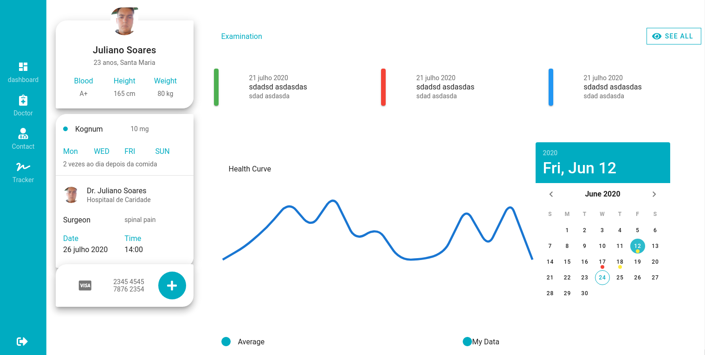

<h2 align="center">
   
 App para práticar VUE.js 

</h2>

  
  

  <a href="#rocket-tecnologias">Tecnologias</a>&nbsp;&nbsp;&nbsp;|&nbsp;&nbsp;&nbsp;
  <a href="#computer-projeto">Projeto</a>&nbsp;&nbsp;&nbsp;

 
<h3>Imagens:<h3>

  

  
## :rocket: Tecnologias
- VueJS
- Vuetify

## :computer: Projeto
> Projeto feito a partir de um vídeo do youtube.
